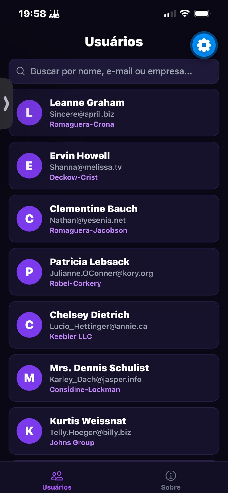

# 📱 User App Native

Aplicação móvel desenvolvida para a disciplina de **Programação para Dispositivos Móveis**. O projeto consiste numa lista dinâmica de utilizadores com suporte para pesquisa em tempo real, navegação inferior fixa e uma interface moderna personalizada em tons de roxo (Dark Theme).

---

## 📸 Demonstração

<div align="center">
  
</div>

> *Nota: Coloca a captura de ecrã da aplicação na pasta `assets` com o nome `app-preview.png` (ou altera o caminho acima para o local onde guardaste a imagem).*

---

## ✨ Funcionalidades

* **Lista de Utilizadores**: Exibição detalhada com avatar dinâmico (inicial do nome), nome, e-mail e empresa.
* **Pesquisa em Tempo Real**: Filtragem instantânea por nome, e-mail ou nome da empresa.
* **Navegação em Abas (Bottom Tabs)**: Alternância entre os ecrãs de **Usuários** e **Sobre**.
* **Design Personalizado**: Interface com Dark Theme estilizada em tons de roxo.
* **Fallback de Dados**: Integração com API REST e dados locais de segurança.

---

## 🛠️ Tecnologias Utilizadas

* [React Native](https://reactnative.dev/)
* [Expo](https://expo.dev/)
* [TypeScript](https://www.typescriptlang.org/)
* [React Navigation](https://reactnavigation.org/)
* [Expo Vector Icons](https://icons.expo.fyi/)

---

## 📁 Estrutura do Projeto

```text
USER-APP-NATIVE/
├── assets/
├── src/
│   ├── components/
│   │   ├── SearchBar.tsx
│   │   └── UserCard.tsx
│   ├── screens/
│   │   ├── UsersScreen.tsx
│   │   └── AboutScreen.tsx
│   ├── services/
│   │   ├── api.ts
│   │   └── userService.ts
│   └── types/
│       └── User.ts
└── App.tsx

🚀 Como Executar o Projeto
Pré-requisitos
Node.js instalado

Aplicação Expo Go instalada no telemóvel (ou um emulador configurado)

Passo a passo
1.Clonar o repositório:
git clone [https://github.com/teu-usuario/USER-APP-NATIVE.git](https://github.com/teu-usuario/USER-APP-NATIVE.git)
cd USER-APP-NATIVE

2.Instalar as dependências:
npm install

3.Iniciar a aplicação:
npx expo start

4.Visualizar no dispositivo:
Abre a aplicação Expo Go no telemóvel e faz o scan do código QR apresentado no terminal.

🎓 Disciplina
Cadeira: Programação para Dispositivos Móveis
